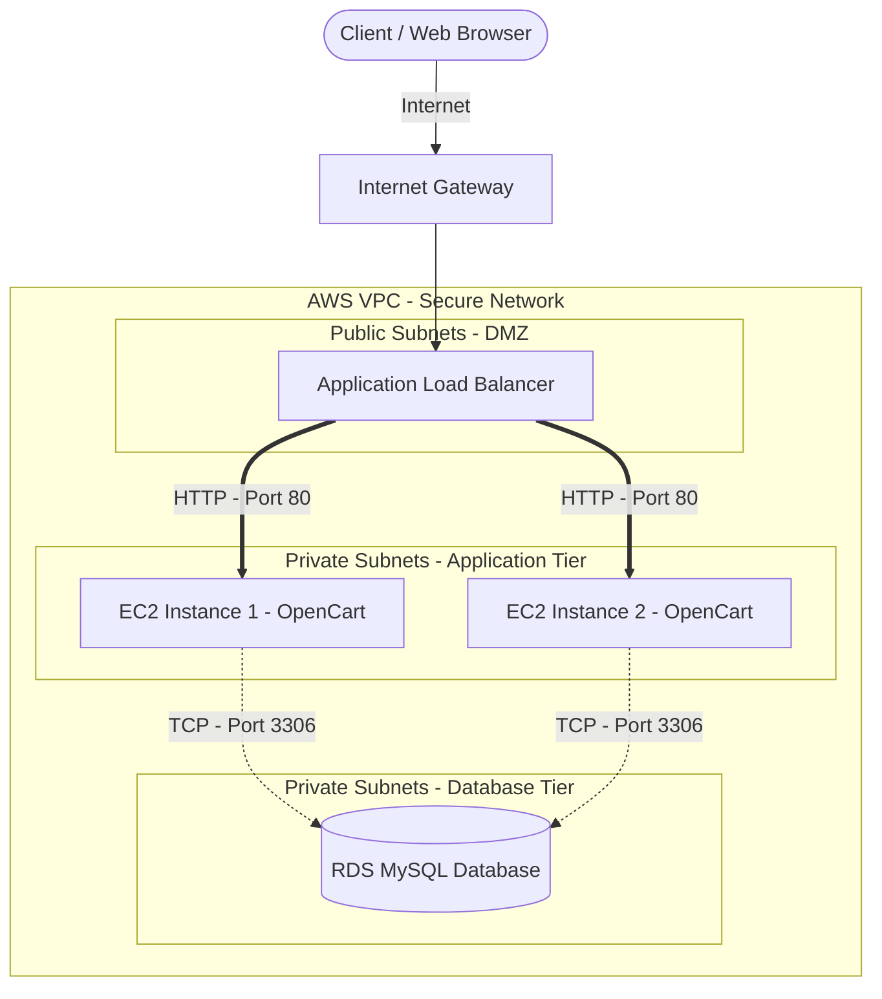

# Secure 2-Tier E-Commerce Infrastructure on AWS

**Production-grade, highly available cloud architecture provisioned entirely through Infrastructure as Code (Terraform).**

---

## Overview

Modern e-commerce platforms demand **resilience**, **security**, and **cost efficiency** — three priorities that often conflict under traditional infrastructure models. This project addresses the challenge head-on by delivering a fully automated, zero-trust AWS architecture that isolates public-facing services from sensitive data layers, scales dynamically under load, and stays within predictable cost boundaries through Free Tier–compatible resource sizing.

The solution implements a **2-tier paradigm** — a public presentation layer behind an Application Load Balancer and a private data tier — deployed across multiple Availability Zones with no single point of failure. Every resource is defined, versioned, and reproducible via Terraform, making the entire environment disposable and repeatable in minutes.

---

## Architecture Highlights

- **Multi-AZ High Availability** — Resources span `us-east-1a` and `us-east-1b`. The ALB distributes traffic across both zones; the Auto Scaling Group replaces failed instances automatically; RDS sits across a dual-subnet subnet group ready for future Multi-AZ failover.

- **Zero-Trust Security Model** — Three-tiered security groups enforce strict east-west traffic rules:
  - `alb_sg` → Accepts HTTP/HTTPS from the internet only.
  - `app_sg` → Accepts traffic exclusively from the ALB security group.
  - `db_sg` → Accepts MySQL (3306) exclusively from the application security group.

- **Auto-Scaling Compute Layer** — An Auto Scaling Group maintains 2–4 `t3.micro` instances running Amazon Linux 2023. A launch template bootstraps each node with Apache (`httpd`) and a health-check endpoint on `/`.

- **Highly Available NAT Layer** — Two NAT Gateways (one per AZ) provide outbound internet access for private subnets without exposing instances to inbound traffic. Elastic IPs are provisioned with explicit dependencies on the Internet Gateway.

- **Infrastructure as Code** — 7 Terraform files, 0 ClickOps. Every resource is tagged, every dependency is explicit, and the entire stack can be spun up or torn down with two commands.

- **Free Tier Optimized** — All resources (RDS `db.t3.micro`, EC2 `t3.micro`, 20 GB gp2 storage) conform to AWS Free Tier limits, keeping the portfolio demo cost at or near zero.

---

## Visual Representation



---

## Project Structure

```
.
├── providers.tf        # AWS Provider configuration (~> 5.0, us-east-1)
├── network.tf          # VPC, IGW, public & private subnets
├── routing.tf          # Elastic IPs, NAT Gateways, route tables
├── security.tf         # Zero-trust security groups (ALB → App → DB)
├── database.tf         # RDS MySQL 8.0 subnet group & instance
├── compute.tf          # ALB, target group, launch template, ASG
├── outputs.tf          # ALB DNS name & RDS endpoint outputs
└── README.md           # This file
```

---

## Prerequisites

| Tool            | Minimum Version | Purpose                              |
|-----------------|-----------------|--------------------------------------|
| [Terraform](https://developer.hashicorp.com/terraform/downloads) | ≥ 1.5 | Infrastructure provisioning           |
| [AWS CLI](https://aws.amazon.com/cli/) | ≥ 2.0 | Credential management & validation    |
| AWS Account     | Free Tier       | Target deployment environment         |
| Git             | Any             | Version control                      |

Ensure your AWS credentials are configured:

```bash
aws configure
```

---

## Deployment Steps

### 1. Clone the Repository

```bash
git clone <repository-url>
cd ecommerce-aws-terraform
```

### 2. Initialize Terraform

```bash
terraform init
```

This downloads the AWS provider (`hashicorp/aws ~> 5.0`) and initializes the backend.

### 3. Review the Execution Plan

```bash
terraform plan
```

Inspect every resource Terraform intends to create — VPC, subnets, NAT Gateways, security groups, RDS, ALB, Auto Scaling Group — before any changes are applied.

### 4. Apply the Infrastructure

```bash
terraform apply
```

Type `yes` when prompted. Provisioning typically completes in **4–6 minutes** (RDS creation is the longest operation).

### 5. Verify the Deployment

Once `terraform apply` finishes, note the outputs:

```
alb_dns_name = "ecommerce-alb-********.us-east-1.elb.amazonaws.com"
rds_endpoint = "ecommerce-production-db.********.us-east-1.rds.amazonaws.com:3306"
```

Open the `alb_dns_name` URL in a browser — you should see:

> *Ecommerce Production Environment - Highly Available*

---

## Cleanup

> **Warning** — Leaving resources running will incur AWS charges, even within Free Tier limits for extended usage. Destroy the infrastructure immediately after review.

```bash
terraform destroy
```

Review the destruction plan, type `yes`, and all resources will be permanently deleted within minutes. The `skip_final_snapshot = true` flag ensures RDS is removed cleanly without retained snapshots.

---

## Key Technical Decisions

- **`t3.micro` over `t2.micro`** — `t3.micro` is the current Free Tier–eligible instance type; `t2.micro` was deprecated from Free Tier eligibility.
- **Zero `backup_retention_period` on RDS** — RDS automated backups exceed Free Tier allowance; disabled to maintain zero-cost compliance.
- **Separate NAT Gateways per AZ** — Avoids cross-AZ data transfer costs on NAT traffic and eliminates a single point of failure in the egress path.
- **`skip_final_snapshot = true`** — Enables clean `terraform destroy` without manual snapshot intervention.
- **Explicit `depends_on` on IGW** — Prevents race conditions where a NAT Gateway or Elastic IP provisions before the Internet Gateway is fully attached.

---

## Future Enhancements

- Add a custom domain with TLS termination via AWS Certificate Manager (ACM) and an HTTPS listener on the ALB.
- Integrate AWS WAF for web application firewall protection.
- Implement Terraform remote state with S3 backend and DynamoDB state locking.
- Add CloudWatch dashboards and alarms for CPU, memory, and request latency.
- Introduce a CI/CD pipeline (GitHub Actions) for `terraform plan` on pull requests.
- Enable RDS Multi-AZ for production failover readiness.

---

*Built by a Senior Cloud/DevOps Engineer — demonstrating infrastructure-as-code discipline, AWS architectural best practices, and production-grade security patterns.*